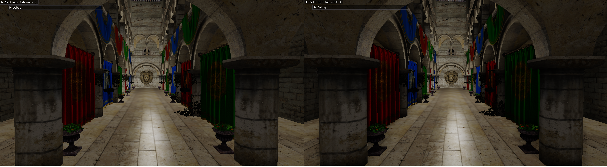

# 3DEngine

Real Time 3D Engine realised during the course 3D Engine at the University of Limoges.

In this 3D Engine we have the following features :

- Normal Camera & Trackball
- Perspective & Orthogonal projection
- Mesh loading
- Lighting ( Phong & Blinn Phong ) with light attenuation
- Scene Graph
- Texture support
- Skybox
- Deffered Shading
- Ambient Occlusion 
- Shadow Maps
- Tone Mapping

